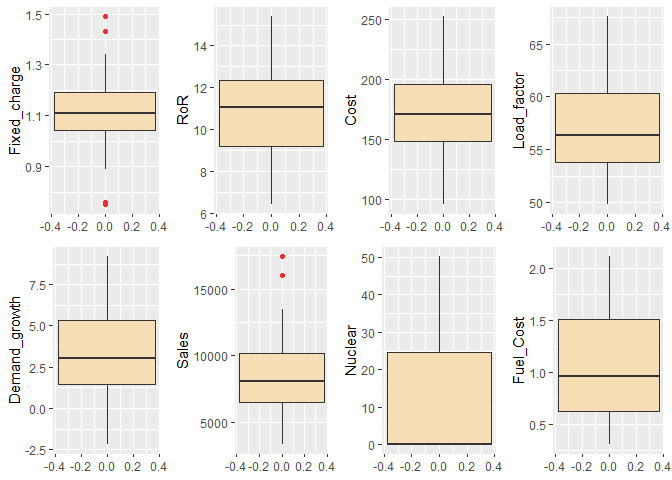
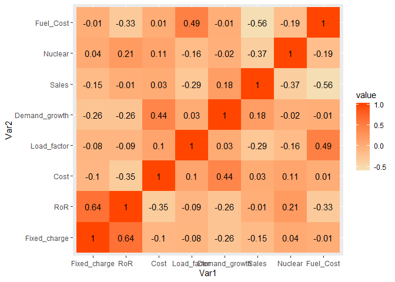

Principal\_Component\_Analysis
================
2020-06-23

``` r
#Pacman tool used for Package-management
if(!require("pacman")) install.packages("pacman")
```

    ## Loading required package: pacman

``` r
if(!require("goeveg")) install.packages("goeveg")
```

    ## Loading required package: goeveg

    ## Welcome to the GoeVeg Package

``` r
pacman::p_load(data.table,ggplot2,reshape2,gridExtra,goeveg)
search()
```

    ##  [1] ".GlobalEnv"         "package:gridExtra"  "package:reshape2"  
    ##  [4] "package:ggplot2"    "package:data.table" "package:goeveg"    
    ##  [7] "package:pacman"     "package:stats"      "package:graphics"  
    ## [10] "package:grDevices"  "package:utils"      "package:datasets"  
    ## [13] "package:methods"    "Autoloads"          "package:base"

# Question 1

## Compute the minimum, maximum, mean, median, and standard deviation for each of the numeric variables using data.table package. Which variable(s) has the largest variability? Explain your answer.

``` r
#Here, we first load the file to R
utilities.df <- read.csv('Utilities.csv')
utilities.dt <- setDT(utilities.df)

#To compute the min, max, mean, median, quartiles of the numeric variables of the dataset
summary(utilities.dt[,2:9]) 
```

    ##   Fixed_charge        RoR             Cost        Load_factor   
    ##  Min.   :0.750   Min.   : 6.40   Min.   : 96.0   Min.   :49.80  
    ##  1st Qu.:1.042   1st Qu.: 9.20   1st Qu.:148.5   1st Qu.:53.77  
    ##  Median :1.110   Median :11.05   Median :170.5   Median :56.35  
    ##  Mean   :1.114   Mean   :10.74   Mean   :168.2   Mean   :56.98  
    ##  3rd Qu.:1.190   3rd Qu.:12.35   3rd Qu.:195.8   3rd Qu.:60.30  
    ##  Max.   :1.490   Max.   :15.40   Max.   :252.0   Max.   :67.60  
    ##  Demand_growth        Sales          Nuclear       Fuel_Cost    
    ##  Min.   :-2.200   Min.   : 3300   Min.   : 0.0   Min.   :0.309  
    ##  1st Qu.: 1.450   1st Qu.: 6458   1st Qu.: 0.0   1st Qu.:0.630  
    ##  Median : 3.000   Median : 8024   Median : 0.0   Median :0.960  
    ##  Mean   : 3.241   Mean   : 8914   Mean   :12.0   Mean   :1.103  
    ##  3rd Qu.: 5.350   3rd Qu.:10128   3rd Qu.:24.6   3rd Qu.:1.516  
    ##  Max.   : 9.200   Max.   :17441   Max.   :50.2   Max.   :2.116

``` r
#To find Standard Deviation of the numeric variables of the dataset
sd_numeric_variables <- apply(utilities.dt[,2:9],2,sd)
names(sd_numeric_variables) <- paste("sd_",names(sd_numeric_variables),sep="")
sd_numeric_variables
```

    ##  sd_Fixed_charge           sd_RoR          sd_Cost   sd_Load_factor 
    ##        0.1845112        2.2440494       41.1913495        4.4611478 
    ## sd_Demand_growth         sd_Sales       sd_Nuclear     sd_Fuel_Cost 
    ##        3.1182503     3549.9840305       16.7919198        0.5560981

``` r
#To find the coefficient of variation of the numeric variables of the dataset
cv_numeric_variables <- apply(utilities.dt[,2:9],2,cv) 
names(cv_numeric_variables) <- paste("cv_",names(cv_numeric_variables),sep="")  
cv_numeric_variables
```

    ##  cv_Fixed_charge           cv_RoR          cv_Cost   cv_Load_factor 
    ##       0.16561590       0.20901391       0.24492154       0.07829697 
    ## cv_Demand_growth         cv_Sales       cv_Nuclear     cv_Fuel_Cost 
    ##       0.96215296       0.39824612       1.39932665       0.50429339

##### Explanation:

\*When considering the standard deviation to be the measure of
variability, we see here that the standard deviation (sd) of Sales is
the largest hence we consider that Sales has the largest variability
compared to other variables.

\*But actually when comparing variables or set of data on basis of their
measure of variability, we take into account of their coefficient of
variation (cv) and when we take that into account, we can clearly see
that Nuclear has the higher coefficient of variation and hence Nuclear
has the largest variability in this case and is more spread out as
compared to other
variables.

# Question 2

## Create boxplots for each of the numeric variables. Are there any extreme values for any of the variables? Which ones? Explain your answer.

``` r
#The same becomes clear when we plot the values in a box-plot. For this we use ggplot2 library pack.
a <- ggplot(utilities.dt) +
  geom_boxplot(aes(y = Fixed_charge), 
               fill = "wheat", outlier.color = "firebrick2")
b <- ggplot(utilities.dt) +
  geom_boxplot(aes(y = RoR), 
               fill = "wheat", outlier.color = "firebrick2")
c <- ggplot(utilities.dt) +
  geom_boxplot(aes(y = Cost), 
               fill = "wheat", outlier.color = "firebrick2")
d <- ggplot(utilities.dt) +
  geom_boxplot(aes(y = Load_factor), 
               fill = "wheat", outlier.color = "firebrick2")
e <- ggplot(utilities.dt) +
  geom_boxplot(aes(y = Demand_growth), 
               fill = "wheat", outlier.color = "firebrick2")
f <- ggplot(utilities.dt) +
  geom_boxplot(aes(y = Sales), 
               fill = "wheat", outlier.color = "firebrick2")
g <- ggplot(utilities.dt) +
  geom_boxplot(aes(y = Nuclear), 
               fill = "wheat", outlier.color = "firebrick2")
h <- ggplot(utilities.dt) +
  geom_boxplot(aes(y = Fuel_Cost), 
               fill = "wheat", outlier.color = "firebrick2")
grid.arrange(a, b, c, d, e, f, g, h, ncol=4)
```

<!-- --> \#\#\#\#\#
Explanation:  
\*Extreme values or outliers are defined as values in the dataset that
fall outside the range of whiskers i.e left whisker and right whisker
wherein the left whisker is the maximum of (Q1-1.5IQR and the minimum
point) and the right whisker is the minimum of (Q3 + 1.5IQR and the
maximum point).

\*Fixed\_charge has extreme values on both the high and low side.
Fixed\_charge has low extreme values of 0.75 and 0.76 for Nevada and San
Diego respectively. It has high extreme value of 1.49 for NY.

\*Sales has extreme values on the high side. Sales has high extreme
values of 15,991 and 17,441 for Nevada and Puget
respectively.

# Question 3

## Create a heatmap for the numeric variables. Discuss any interesting trend you see in this chart.

``` r
#Inorder to see the correlation between different paramaters of the dataset, we use a heat-map

mydata <- utilities.dt[,2:9] 
cormat <- round(cor(mydata),2)

#cormat is melted using reshape package
melted_cormat <- melt(cormat)

ggplot(melted_cormat, aes(x=Var1, y=Var2, fill=value)) +
  scale_fill_gradient(low="wheat", high="orangered") +
  geom_tile() +
  geom_text(aes(x=Var1, y=Var2,label=value))
```

<!-- --> \#\#\#\#\# Explanation:
\*From the heat-map, it is clear that there’s a highly positive
correlation between (RoR)Rate of Return on capital and
(Fixed\_charge)Fixed Charge Coverage Ratio (0.64). What it basically
means is that a company which pays its fixed charges (before tax)
effectively will naturally be better equipped to give a better return on
investment.

\*It is both intuitive and interesting that the Fixed\_charge has a high
correlation with the (RoR)Rate of Return on Capital. This makes sense
that if the company has good cash flow and cover their debt obligations,
their rate of return would be correspondingly higher due to the lower
cost of debt associated.

\*Another interesting correlation is between Fuel\_Cost (in cents per
KWh) and Sales (KWh use per year) (-0.56). The highly negative
correlation clearly shows that the more Sale of energy when the fuel
costs are
low.

# Question 4

## 4\. Run principal component analysis using unscaled numeric variables in the dataset. How do you interpret the results from this model?

``` r
#Inorder to reduce the dimension of the datasets, we make use of Principal Component Analysis

utilities.pca <- prcomp(utilities.dt[,2:9],center=TRUE)
utilities.pca
```

    ## Standard deviations (1, .., p=8):
    ## [1] 3549.9900525   41.2691339   15.4921516    4.0009943    2.7827284
    ## [6]    1.9765907    0.3501172    0.1224373
    ## 
    ## Rotation (n x k) = (8 x 8):
    ##                         PC1           PC2           PC3           PC4
    ## Fixed_charge   7.883140e-06 -0.0004460932  0.0001146357 -0.0057978329
    ## RoR            6.081397e-06 -0.0186257078  0.0412535878  0.0292444838
    ## Cost          -3.247724e-04  0.9974928360 -0.0566502956 -0.0179103135
    ## Load_factor    3.618357e-04  0.0111104272 -0.0964680806  0.9930009368
    ## Demand_growth -1.549616e-04  0.0326730808 -0.0038575008  0.0544730799
    ## Sales         -9.999983e-01 -0.0002209801  0.0017377455  0.0005270008
    ## Nuclear        1.767632e-03  0.0589056695  0.9927317841  0.0949073699
    ## Fuel_Cost      8.780470e-05  0.0001659524 -0.0157634569  0.0276496391
    ##                         PC5           PC6           PC7           PC8
    ## Fixed_charge   0.0198566131 -0.0583722527 -1.002990e-01  9.930280e-01
    ## RoR            0.2028309717 -0.9735822744 -5.984233e-02 -6.717166e-02
    ## Cost           0.0355836487 -0.0144563569 -9.986723e-04 -1.312104e-03
    ## Load_factor    0.0495177973  0.0333700701  2.930752e-02  9.745357e-03
    ## Demand_growth -0.9768581322 -0.2038187556  8.898790e-03  8.784363e-03
    ## Sales          0.0001471164  0.0001237088 -9.721241e-05  5.226863e-06
    ## Nuclear       -0.0057261758  0.0430954352 -1.043775e-02  2.059461e-03
    ## Fuel_Cost     -0.0215054038  0.0633116915 -9.926283e-01 -9.594372e-02

``` r
summary(utilities.pca)
```

    ## Importance of components:
    ##                              PC1      PC2      PC3   PC4   PC5   PC6
    ## Standard deviation     3549.9901 41.26913 15.49215 4.001 2.783 1.977
    ## Proportion of Variance    0.9998  0.00014  0.00002 0.000 0.000 0.000
    ## Cumulative Proportion     0.9998  0.99998  1.00000 1.000 1.000 1.000
    ##                           PC7    PC8
    ## Standard deviation     0.3501 0.1224
    ## Proportion of Variance 0.0000 0.0000
    ## Cumulative Proportion  1.0000 1.0000

``` r
utilities.pca$rotation
```

    ##                         PC1           PC2           PC3           PC4
    ## Fixed_charge   7.883140e-06 -0.0004460932  0.0001146357 -0.0057978329
    ## RoR            6.081397e-06 -0.0186257078  0.0412535878  0.0292444838
    ## Cost          -3.247724e-04  0.9974928360 -0.0566502956 -0.0179103135
    ## Load_factor    3.618357e-04  0.0111104272 -0.0964680806  0.9930009368
    ## Demand_growth -1.549616e-04  0.0326730808 -0.0038575008  0.0544730799
    ## Sales         -9.999983e-01 -0.0002209801  0.0017377455  0.0005270008
    ## Nuclear        1.767632e-03  0.0589056695  0.9927317841  0.0949073699
    ## Fuel_Cost      8.780470e-05  0.0001659524 -0.0157634569  0.0276496391
    ##                         PC5           PC6           PC7           PC8
    ## Fixed_charge   0.0198566131 -0.0583722527 -1.002990e-01  9.930280e-01
    ## RoR            0.2028309717 -0.9735822744 -5.984233e-02 -6.717166e-02
    ## Cost           0.0355836487 -0.0144563569 -9.986723e-04 -1.312104e-03
    ## Load_factor    0.0495177973  0.0333700701  2.930752e-02  9.745357e-03
    ## Demand_growth -0.9768581322 -0.2038187556  8.898790e-03  8.784363e-03
    ## Sales          0.0001471164  0.0001237088 -9.721241e-05  5.226863e-06
    ## Nuclear       -0.0057261758  0.0430954352 -1.043775e-02  2.059461e-03
    ## Fuel_Cost     -0.0215054038  0.0633116915 -9.926283e-01 -9.594372e-02

##### Explanation:

\*Based on the principle component analysis, PC1 appears to account for
99.98% and PC2 appears to account for .014% of the variation in the
data. Therefore, PC1 should be the primary focus of further analysis.
Taking a deeper dive, we see that sales accounts for almost all of the
variation in PC1. This indicates that sales might be too heavily
weighted and therefore skewing the
analysis.

# Question 5

## Next, run principal component model after scaling the numeric variables. Did the results/interpretations change? How so? Explain your answers.

``` r
#Scaling of PCA is done to reduce effect of Sales

utilities_scaled.pca <- prcomp(utilities.dt[,2:9],center=TRUE,scale=TRUE)
utilities_scaled.pca
```

    ## Standard deviations (1, .., p=8):
    ## [1] 1.4740918 1.3785018 1.1504236 0.9983701 0.8056180 0.7560814 0.4652989
    ## [8] 0.4115657
    ## 
    ## Rotation (n x k) = (8 x 8):
    ##                       PC1         PC2         PC3         PC4        PC5
    ## Fixed_charge   0.44554526 -0.23217669  0.06712849 -0.55549758  0.4008403
    ## RoR            0.57119021 -0.10053490  0.07123367 -0.33209594 -0.3359424
    ## Cost          -0.34869054  0.16130192  0.46733094 -0.40908380  0.2685680
    ## Load_factor   -0.28890116 -0.40918419 -0.14259793 -0.33373941 -0.6800711
    ## Demand_growth -0.35536100  0.28293270  0.28146360 -0.39139699 -0.1626375
    ## Sales          0.05383343  0.60309487 -0.33199086 -0.19086550 -0.1319721
    ## Nuclear        0.16797023 -0.08536118  0.73768406  0.33348714 -0.2496462
    ## Fuel_Cost     -0.33584032 -0.53988503 -0.13442354 -0.03960132  0.2926660
    ##                       PC6         PC7         PC8
    ## Fixed_charge  -0.00654016  0.20578234 -0.48107955
    ## RoR           -0.13326000 -0.15026737  0.62855128
    ## Cost           0.53750238 -0.11762875  0.30294347
    ## Load_factor    0.29890373  0.06429342 -0.24781930
    ## Demand_growth -0.71916993 -0.05155339 -0.12223012
    ## Sales          0.14953365  0.66050223  0.10339649
    ## Nuclear        0.02644086  0.48879175 -0.08466572
    ## Fuel_Cost     -0.25235278  0.48914707  0.43300956

``` r
summary(utilities_scaled.pca)
```

    ## Importance of components:
    ##                           PC1    PC2    PC3    PC4     PC5     PC6     PC7
    ## Standard deviation     1.4741 1.3785 1.1504 0.9984 0.80562 0.75608 0.46530
    ## Proportion of Variance 0.2716 0.2375 0.1654 0.1246 0.08113 0.07146 0.02706
    ## Cumulative Proportion  0.2716 0.5091 0.6746 0.7992 0.88031 0.95176 0.97883
    ##                            PC8
    ## Standard deviation     0.41157
    ## Proportion of Variance 0.02117
    ## Cumulative Proportion  1.00000

``` r
utilities_scaled.pca$rotation
```

    ##                       PC1         PC2         PC3         PC4        PC5
    ## Fixed_charge   0.44554526 -0.23217669  0.06712849 -0.55549758  0.4008403
    ## RoR            0.57119021 -0.10053490  0.07123367 -0.33209594 -0.3359424
    ## Cost          -0.34869054  0.16130192  0.46733094 -0.40908380  0.2685680
    ## Load_factor   -0.28890116 -0.40918419 -0.14259793 -0.33373941 -0.6800711
    ## Demand_growth -0.35536100  0.28293270  0.28146360 -0.39139699 -0.1626375
    ## Sales          0.05383343  0.60309487 -0.33199086 -0.19086550 -0.1319721
    ## Nuclear        0.16797023 -0.08536118  0.73768406  0.33348714 -0.2496462
    ## Fuel_Cost     -0.33584032 -0.53988503 -0.13442354 -0.03960132  0.2926660
    ##                       PC6         PC7         PC8
    ## Fixed_charge  -0.00654016  0.20578234 -0.48107955
    ## RoR           -0.13326000 -0.15026737  0.62855128
    ## Cost           0.53750238 -0.11762875  0.30294347
    ## Load_factor    0.29890373  0.06429342 -0.24781930
    ## Demand_growth -0.71916993 -0.05155339 -0.12223012
    ## Sales          0.14953365  0.66050223  0.10339649
    ## Nuclear        0.02644086  0.48879175 -0.08466572
    ## Fuel_Cost     -0.25235278  0.48914707  0.43300956

##### Explanation:

\*When we scale the data, we see a big change in the distribution of the
amount of weighting each Principle Component accounts for. We see that
the distribution is much more even, with PC1 account for 27.16%, PC2 -
23.75%, PC3 - 16.54%, PC 4 - 12.46%, PC5 - 8.1%, and PC6 -7.1%.

\*In order to achieve the 90% threshold, we will have to consider PC1 -
PC6 in order to capture most of the variation. We can see from this
analysis that scaling the data is the appropriate way to perform this
analysis, to prevent our analysis from being negatively affected by
measurement units.
