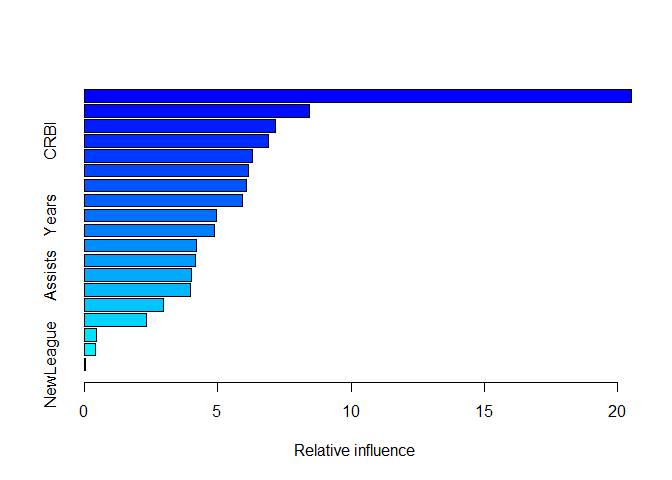

Hitters
================

``` r
if(!require("pacman")) install.packages("pacman")
pacman::p_load(tidyverse, reshape, gplots, ggmap, 
               mlbench, data.table,ISLR, MASS, rpart, rpart.plot, caret,
               randomForest, gbm, tree,leaps)
search()
theme_set(theme_classic())
```

``` r
#Loading Data

raw_hitters.df <- Hitters
head(raw_hitters.df)
```

    ##                   AtBat Hits HmRun Runs RBI Walks Years CAtBat CHits
    ## -Andy Allanson      293   66     1   30  29    14     1    293    66
    ## -Alan Ashby         315   81     7   24  38    39    14   3449   835
    ## -Alvin Davis        479  130    18   66  72    76     3   1624   457
    ## -Andre Dawson       496  141    20   65  78    37    11   5628  1575
    ## -Andres Galarraga   321   87    10   39  42    30     2    396   101
    ## -Alfredo Griffin    594  169     4   74  51    35    11   4408  1133
    ##                   CHmRun CRuns CRBI CWalks League Division PutOuts Assists
    ## -Andy Allanson         1    30   29     14      A        E     446      33
    ## -Alan Ashby           69   321  414    375      N        W     632      43
    ## -Alvin Davis          63   224  266    263      A        W     880      82
    ## -Andre Dawson        225   828  838    354      N        E     200      11
    ## -Andres Galarraga     12    48   46     33      N        E     805      40
    ## -Alfredo Griffin      19   501  336    194      A        W     282     421
    ##                   Errors Salary NewLeague
    ## -Andy Allanson        20     NA         A
    ## -Alan Ashby           10  475.0         N
    ## -Alvin Davis          14  480.0         A
    ## -Andre Dawson          3  500.0         N
    ## -Andres Galarraga      4   91.5         N
    ## -Alfredo Griffin      25  750.0         A

``` r
str(raw_hitters.df)
```

    ## 'data.frame':    322 obs. of  20 variables:
    ##  $ AtBat    : int  293 315 479 496 321 594 185 298 323 401 ...
    ##  $ Hits     : int  66 81 130 141 87 169 37 73 81 92 ...
    ##  $ HmRun    : int  1 7 18 20 10 4 1 0 6 17 ...
    ##  $ Runs     : int  30 24 66 65 39 74 23 24 26 49 ...
    ##  $ RBI      : int  29 38 72 78 42 51 8 24 32 66 ...
    ##  $ Walks    : int  14 39 76 37 30 35 21 7 8 65 ...
    ##  $ Years    : int  1 14 3 11 2 11 2 3 2 13 ...
    ##  $ CAtBat   : int  293 3449 1624 5628 396 4408 214 509 341 5206 ...
    ##  $ CHits    : int  66 835 457 1575 101 1133 42 108 86 1332 ...
    ##  $ CHmRun   : int  1 69 63 225 12 19 1 0 6 253 ...
    ##  $ CRuns    : int  30 321 224 828 48 501 30 41 32 784 ...
    ##  $ CRBI     : int  29 414 266 838 46 336 9 37 34 890 ...
    ##  $ CWalks   : int  14 375 263 354 33 194 24 12 8 866 ...
    ##  $ League   : Factor w/ 2 levels "A","N": 1 2 1 2 2 1 2 1 2 1 ...
    ##  $ Division : Factor w/ 2 levels "E","W": 1 2 2 1 1 2 1 2 2 1 ...
    ##  $ PutOuts  : int  446 632 880 200 805 282 76 121 143 0 ...
    ##  $ Assists  : int  33 43 82 11 40 421 127 283 290 0 ...
    ##  $ Errors   : int  20 10 14 3 4 25 7 9 19 0 ...
    ##  $ Salary   : num  NA 475 480 500 91.5 750 70 100 75 1100 ...
    ##  $ NewLeague: Factor w/ 2 levels "A","N": 1 2 1 2 2 1 1 1 2 1 ...

Q1. Remove the observations with unknown salary information. How many
observations were removed in this process?

``` r
hitters.df <- raw_hitters.df[!is.na(raw_hitters.df$Salary),]
hitters.df
```

    ##                    AtBat Hits HmRun Runs RBI Walks Years CAtBat CHits
    ## -Alan Ashby          315   81     7   24  38    39    14   3449   835
    ## -Alvin Davis         479  130    18   66  72    76     3   1624   457
    ## -Andre Dawson        496  141    20   65  78    37    11   5628  1575
    ## -Andres Galarraga    321   87    10   39  42    30     2    396   101
    ## -Alfredo Griffin     594  169     4   74  51    35    11   4408  1133
    ## -Al Newman           185   37     1   23   8    21     2    214    42
    ## -Argenis Salazar     298   73     0   24  24     7     3    509   108
    ## -Andres Thomas       323   81     6   26  32     8     2    341    86
    ## -Andre Thornton      401   92    17   49  66    65    13   5206  1332
    ## -Alan Trammell       574  159    21  107  75    59    10   4631  1300
    ## -Alex Trevino        202   53     4   31  26    27     9   1876   467
    ## -Andy VanSlyke       418  113    13   48  61    47     4   1512   392
    ## -Alan Wiggins        239   60     0   30  11    22     6   1941   510
    ## -Bill Almon          196   43     7   29  27    30    13   3231   825
    ## -Buddy Bell          568  158    20   89  75    73    15   8068  2273
    ## -Buddy Biancalana    190   46     2   24   8    15     5    479   102
    ## -Bruce Bochy         127   32     8   16  22    14     8    727   180
    ## -Barry Bonds         413   92    16   72  48    65     1    413    92
    ## -Bobby Bonilla       426  109     3   55  43    62     1    426   109
    ## -Bob Brenly          472  116    16   60  62    74     6   1924   489
    ## -Bill Buckner        629  168    18   73 102    40    18   8424  2464
    ## -Brett Butler        587  163     4   92  51    70     6   2695   747
    ## -Bob Dernier         324   73     4   32  18    22     7   1931   491
    ## -Bo Diaz             474  129    10   50  56    40    10   2331   604
    ## -Bill Doran          550  152     6   92  37    81     5   2308   633
    ## -Brian Downing       513  137    20   90  95    90    14   5201  1382
    ## -Billy Hatcher       419  108     6   55  36    22     3    591   149
    ## -Brook Jacoby        583  168    17   83  80    56     5   1646   452
    ## -Bob Kearney         204   49     6   23  25    12     7   1309   308
    ## -Bill Madlock        379  106    10   38  60    30    14   6207  1906
    ## -Bob Melvin          268   60     5   24  25    15     2    350    78
    ## -BillyJo Robidoux    181   41     1   15  21    33     2    232    50
    ## -Bill Schroeder      217   46     7   32  19     9     4    694   160
    ## -Chris Bando         254   68     2   28  26    22     6    999   236
    ## -Chris Brown         416  132     7   57  49    33     3    932   273
    ## -Carmen Castillo     205   57     8   34  32     9     5    756   192
    ## -Chili Davis         526  146    13   71  70    84     6   2648   715
    ## -Carlton Fisk        457  101    14   42  63    22    17   6521  1767
    ## -Curt Ford           214   53     2   30  29    23     2    226    59
    ## -Carney Lansford     591  168    19   80  72    39     9   4478  1307
    ## -Chet Lemon          403  101    12   45  53    39    12   5150  1429
    ## -Candy Maldonado     405  102    18   49  85    20     6    950   231
    ## -Carmelo Martinez    244   58     9   28  25    35     4   1335   333
    ## -Craig Reynolds      313   78     6   32  41    12    12   3742   968
    ## -Cal Ripken          627  177    25   98  81    70     6   3210   927
    ## -Cory Snyder         416  113    24   58  69    16     1    416   113
    ## -Chris Speier        155   44     6   21  23    15    16   6631  1634
    ## -Curt Wilkerson      236   56     0   27  15    11     4   1115   270
    ## -Dave Anderson       216   53     1   31  15    22     4    926   210
    ## -Don Baylor          585  139    31   93  94    62    17   7546  1982
    ## -Daryl Boston        199   53     5   29  22    21     3    514   120
    ## -Darnell Coles       521  142    20   67  86    45     4    815   205
    ## -Dave Concepcion     311   81     3   42  30    26    17   8247  2198
    ## -Doug DeCinces       512  131    26   69  96    52    14   5347  1397
    ## -Darrell Evans       507  122    29   78  85    91    18   7761  1947
    ## -Dwight Evans        529  137    26   86  97    97    15   6661  1785
    ## -Damaso Garcia       424  119     6   57  46    13     9   3651  1046
    ## -Dan Gladden         351   97     4   55  29    39     4   1258   353
    ## -Dave Henderson      388  103    15   59  47    39     6   2174   555
    ## -Donnie Hill         339   96     4   37  29    23     4   1064   290
    ## -Davey Lopes         255   70     7   49  35    43    15   6311  1661
    ## -Don Mattingly       677  238    31  117 113    53     5   2223   737
    ## -Dale Murphy         614  163    29   89  83    75    11   5017  1388
    ## -Dwayne Murphy       329   83     9   50  39    56     9   3828   948
    ## -Dave Parker         637  174    31   89 116    56    14   6727  2024
    ## -Dan Pasqua          280   82    16   44  45    47     2    428   113
    ## -Darrell Porter      155   41    12   21  29    22    16   5409  1338
    ## -Dick Schofield      458  114    13   67  57    48     4   1350   298
    ## -Don Slaught         314   83    13   39  46    16     5   1457   405
    ## -Darryl Strawberry   475  123    27   76  93    72     4   1810   471
    ## -Dale Sveum          317   78     7   35  35    32     1    317    78
    ## -Danny Tartabull     511  138    25   76  96    61     3    592   164
    ## -Denny Walling       382  119    13   54  58    36    12   2133   594
    ## -Dave Winfield       565  148    24   90 104    77    14   7287  2083
    ## -Eric Davis          415  115    27   97  71    68     3    711   184
    ## -Eddie Milner        424  110    15   70  47    36     7   2130   544
    ## -Eddie Murray        495  151    17   61  84    78    10   5624  1679
    ## -Ed Romero           233   49     2   41  23    18     8   1350   336
    ## -Frank White         566  154    22   76  84    43    14   6100  1583
    ## -George Bell         641  198    31  101 108    41     5   2129   610
    ## -Glenn Braggs        215   51     4   19  18    11     1    215    51
    ## -George Brett        441  128    16   70  73    80    14   6675  2095
    ## -Greg Brock          325   76    16   33  52    37     5   1506   351
    ## -Gary Carter         490  125    24   81 105    62    13   6063  1646
    ## -Glenn Davis         574  152    31   91 101    64     3    985   260
    ## -Gary Gaetti         596  171    34   91 108    52     6   2862   728
    ## -Greg Gagne          472  118    12   63  54    30     4    793   187
    ## -George Hendrick     283   77    14   45  47    26    16   6840  1910
    ## -Glenn Hubbard       408   94     4   42  36    66     9   3573   866
    ## -Garth Iorg          327   85     3   30  44    20     8   2140   568
    ## -Gary Matthews       370   96    21   49  46    60    15   6986  1972
    ## -Graig Nettles       354   77    16   36  55    41    20   8716  2172
    ## -Gary Pettis         539  139     5   93  58    69     5   1469   369
    ## -Gary Redus          340   84    11   62  33    47     5   1516   376
    ## -Garry Templeton     510  126     2   42  44    35    11   5562  1578
    ## -Greg Walker         282   78    13   37  51    29     5   1649   453
    ## -Gary Ward           380  120     5   54  51    31     8   3118   900
    ## -Glenn Wilson        584  158    15   70  84    42     5   2358   636
    ## -Harold Baines       570  169    21   72  88    38     7   3754  1077
    ## -Hubie Brooks        306  104    14   50  58    25     7   2954   822
    ## -Howard Johnson      220   54    10   30  39    31     5   1185   299
    ## -Hal McRae           278   70     7   22  37    18    18   7186  2081
    ## -Harold Reynolds     445   99     1   46  24    29     4    618   129
    ## -Harry Spilman       143   39     5   18  30    15     9    639   151
    ## -Herm Winningham     185   40     4   23  11    18     3    524   125
    ## -Jesse Barfield      589  170    40  107 108    69     6   2325   634
    ## -Juan Beniquez       343  103     6   48  36    40    15   4338  1193
    ## -John Cangelosi      438  103     2   65  32    71     2    440   103
    ## -Jose Canseco        600  144    33   85 117    65     2    696   173
    ## -Joe Carter          663  200    29  108 121    32     4   1447   404
    ## -Jack Clark          232   55     9   34  23    45    12   4405  1213
    ## -Jose Cruz           479  133    10   48  72    55    17   7472  2147
    ## -Jody Davis          528  132    21   61  74    41     6   2641   671
    ## -Jim Dwyer           160   39     8   18  31    22    14   2128   543
    ## -Julio Franco        599  183    10   80  74    32     5   2482   715
    ## -Jim Gantner         497  136     7   58  38    26    11   3871  1066
    ## -Johnny Grubb        210   70    13   32  51    28    15   4040  1130
    ## -Jack Howell         151   41     4   26  21    19     2    288    68
    ## -John Kruk           278   86     4   33  38    45     1    278    86
    ## -Jeffrey Leonard     341   95     6   48  42    20    10   2964   808
    ## -Jim Morrison        537  147    23   58  88    47    10   2744   730
    ## -John Moses          399  102     3   56  34    34     5    670   167
    ## -Jerry Mumphrey      309   94     5   37  32    26    13   4618  1330
    ## -Jim Presley         616  163    27   83 107    32     3   1437   377
    ## -Johnny Ray          579  174     7   67  78    58     6   3053   880
    ## -Jeff Reed           165   39     2   13   9    16     3    196    44
    ## -Jim Rice            618  200    20   98 110    62    13   7127  2163
    ## -Jerry Royster       257   66     5   31  26    32    14   3910   979
    ## -John Russell        315   76    13   35  60    25     3    630   151
    ## -Juan Samuel         591  157    16   90  78    26     4   2020   541
    ## -John Shelby         404   92    11   54  49    18     6   1354   325
    ## -Joel Skinner        315   73     5   23  37    16     4    450   108
    ## -Jim Sundberg        429   91    12   41  42    57    13   5590  1397
    ## -Jose Uribe          453  101     3   46  43    61     3    948   218
    ## -Joel Youngblood     184   47     5   20  28    18    11   3327   890
    ## -Kevin Bass          591  184    20   83  79    38     5   1689   462
    ## -Kal Daniels         181   58     6   34  23    22     1    181    58
    ## -Kirk Gibson         441  118    28   84  86    68     8   2723   750
    ## -Ken Griffey         490  150    21   69  58    35    14   6126  1839
    ## -Keith Hernandez     551  171    13   94  83    94    13   6090  1840
    ## -Kent Hrbek          550  147    29   85  91    71     6   2816   815
    ## -Ken Landreaux       283   74     4   34  29    22    10   3919  1062
    ## -Kevin McReynolds    560  161    26   89  96    66     4   1789   470
    ## -Kevin Mitchell      328   91    12   51  43    33     2    342    94
    ## -Keith Moreland      586  159    12   72  79    53     9   3082   880
    ## -Ken Oberkfell       503  136     5   62  48    83    10   3423   970
    ## -Ken Phelps          344   85    24   69  64    88     7    911   214
    ## -Kirby Puckett       680  223    31  119  96    34     3   1928   587
    ## -Kurt Stillwell      279   64     0   31  26    30     1    279    64
    ## -Leon Durham         484  127    20   66  65    67     7   3006   844
    ## -Len Dykstra         431  127     8   77  45    58     2    667   187
    ## -Larry Herndon       283   70     8   33  37    27    12   4479  1222
    ## -Lee Lacy            491  141    11   77  47    37    15   4291  1240
    ## -Len Matuszek        199   52     9   26  28    21     6    805   191
    ## -Lloyd Moseby        589  149    21   89  86    64     7   3558   928
    ## -Lance Parrish       327   84    22   53  62    38    10   4273  1123
    ## -Larry Parrish       464  128    28   67  94    52    13   5829  1552
    ## -Larry Sheets        338   92    18   42  60    21     3    682   185
    ## -Lou Whitaker        584  157    20   95  73    63    10   4704  1320
    ## -Mike Aldrete        216   54     2   27  25    33     1    216    54
    ## -Marty Barrett       625  179     4   94  60    65     5   1696   476
    ## -Mike Davis          489  131    19   77  55    34     7   2051   549
    ## -Mike Diaz           209   56    12   22  36    19     2    216    58
    ## -Mariano Duncan      407   93     8   47  30    30     2    969   230
    ## -Mike Easler         490  148    14   64  78    49    13   3400  1000
    ## -Mel Hall            442  131    18   68  77    33     6   1416   398
    ## -Mike Heath          288   65     8   30  36    27     9   2815   698
    ## -Mike Kingery        209   54     3   25  14    12     1    209    54
    ## -Mike LaValliere     303   71     3   18  30    36     3    344    76
    ## -Mike Marshall       330   77    19   47  53    27     6   1928   516
    ## -Mike Pagliarulo     504  120    28   71  71    54     3   1085   259
    ## -Mark Salas          258   60     8   28  33    18     3    638   170
    ## -Mike Schmidt         20    1     0    0   0     0     2     41     9
    ## -Mike Scioscia       374   94     5   36  26    62     7   1968   519
    ## -Mickey Tettleton    211   43    10   26  35    39     3    498   116
    ## -Milt Thompson       299   75     6   38  23    26     3    580   160
    ## -Mitch Webster       576  167     8   89  49    57     4    822   232
    ## -Mookie Wilson       381  110     9   61  45    32     7   3015   834
    ## -Marvell Wynne       288   76     7   34  37    15     4   1644   408
    ## -Mike Young          369   93     9   43  42    49     5   1258   323
    ## -Ozzie Guillen       547  137     2   58  47    12     2   1038   271
    ## -Oddibe McDowell     572  152    18  105  49    65     2    978   249
    ## -Ozzie Smith         514  144     0   67  54    79     9   4739  1169
    ## -Ozzie Virgil        359   80    15   45  48    63     7   1493   359
    ## -Phil Bradley        526  163    12   88  50    77     4   1556   470
    ## -Phil Garner         313   83     9   43  41    30    14   5885  1543
    ## -Pete Incaviglia     540  135    30   82  88    55     1    540   135
    ## -Paul Molitor        437  123     9   62  55    40     9   4139  1203
    ## -Pete Rose           237   52     0   15  25    30    24  14053  4256
    ## -Pat Sheridan        236   56     6   41  19    21     5   1257   329
    ## -Pat Tabler          473  154     6   61  48    29     6   1966   566
    ## -Rafael Belliard     309   72     0   33  31    26     5    354    82
    ## -Rick Burleson       271   77     5   35  29    33    12   4933  1358
    ## -Randy Bush          357   96     7   50  45    39     5   1394   344
    ## -Rick Cerone         216   56     4   22  18    15    12   2796   665
    ## -Ron Cey             256   70    13   42  36    44    16   7058  1845
    ## -Rob Deer            466  108    33   75  86    72     3    652   142
    ## -Rick Dempsey        327   68    13   42  29    45    18   3949   939
    ## -Ron Hassey          341  110     9   45  49    46     9   2331   658
    ## -Rickey Henderson    608  160    28  130  74    89     8   4071  1182
    ## -Reggie Jackson      419  101    18   65  58    92    20   9528  2510
    ## -Ron Kittle          376   82    21   42  60    35     5   1770   408
    ## -Ray Knight          486  145    11   51  76    40    11   3967  1102
    ## -Rick Leach          246   76     5   35  39    13     6    912   234
    ## -Rick Manning        205   52     8   31  27    17    12   5134  1323
    ## -Rance Mulliniks     348   90    11   50  45    43    10   2288   614
    ## -Ron Oester          523  135     8   52  44    52     9   3368   895
    ## -Rey Quinones        312   68     2   32  22    24     1    312    68
    ## -Rafael Ramirez      496  119     8   57  33    21     7   3358   882
    ## -Ronn Reynolds       126   27     3    8  10     5     4    239    49
    ## -Ron Roenicke        275   68     5   42  42    61     6    961   238
    ## -Ryne Sandberg       627  178    14   68  76    46     6   3146   902
    ## -Rafael Santana      394   86     1   38  28    36     4   1089   267
    ## -Rick Schu           208   57     8   32  25    18     3    653   170
    ## -Ruben Sierra        382  101    16   50  55    22     1    382   101
    ## -Roy Smalley         459  113    20   59  57    68    12   5348  1369
    ## -Robby Thompson      549  149     7   73  47    42     1    549   149
    ## -Rob Wilfong         288   63     3   25  33    16    10   2682   667
    ## -Robin Yount         522  163     9   82  46    62    13   7037  2019
    ## -Steve Balboni       512  117    29   54  88    43     6   1750   412
    ## -Scott Bradley       220   66     5   20  28    13     3    290    80
    ## -Sid Bream           522  140    16   73  77    60     4    730   185
    ## -Steve Buechele      461  112    18   54  54    35     2    680   160
    ## -Shawon Dunston      581  145    17   66  68    21     2    831   210
    ## -Scott Fletcher      530  159     3   82  50    47     6   1619   426
    ## -Steve Garvey        557  142    21   58  81    23    18   8759  2583
    ## -Steve Jeltz         439   96     0   44  36    65     4    711   148
    ## -Steve Lombardozzi   453  103     8   53  33    52     2    507   123
    ## -Spike Owen          528  122     1   67  45    51     4   1716   403
    ## -Steve Sax           633  210     6   91  56    59     6   3070   872
    ## -Tony Bernazard      562  169    17   88  73    53     8   3181   841
    ## -Tom Brookens        281   76     3   42  25    20     8   2658   657
    ## -Tom Brunansky       593  152    23   69  75    53     6   2765   686
    ## -Tony Fernandez      687  213    10   91  65    27     4   1518   448
    ## -Tim Flannery        368  103     3   48  28    54     8   1897   493
    ## -Tom Foley           263   70     1   26  23    30     4    888   220
    ## -Tony Gwynn          642  211    14  107  59    52     5   2364   770
    ## -Terry Harper        265   68     8   26  30    29     7   1337   339
    ## -Tommy Herr          559  141     2   48  61    73     8   3162   874
    ## -Tim Hulett          520  120    17   53  44    21     4    927   227
    ## -Terry Kennedy        19    4     1    2   3     1     1     19     4
    ## -Tito Landrum        205   43     2   24  17    20     7    854   219
    ## -Tim Laudner         193   47    10   21  29    24     6   1136   256
    ## -Tom Paciorek        213   61     4   17  22     3    17   4061  1145
    ## -Tony Pena           510  147    10   56  52    53     7   2872   821
    ## -Terry Pendleton     578  138     1   56  59    34     3   1399   357
    ## -Tony Phillips       441  113     5   76  52    76     5   1546   397
    ## -Terry Puhl          172   42     3   17  14    15    10   4086  1150
    ## -Ted Simmons         127   32     4   14  25    12    19   8396  2402
    ## -Tim Teufel          279   69     4   35  31    32     4   1359   355
    ## -Tim Wallach         480  112    18   50  71    44     7   3031   771
    ## -Vince Coleman       600  139     0   94  29    60     2   1236   309
    ## -Von Hayes           610  186    19  107  98    74     6   2728   753
    ## -Vance Law           360   81     5   37  44    37     7   2268   566
    ## -Wally Backman       387  124     1   67  27    36     7   1775   506
    ## -Wade Boggs          580  207     8  107  71   105     5   2778   978
    ## -Will Clark          408  117    11   66  41    34     1    408   117
    ## -Wally Joyner        593  172    22   82 100    57     1    593   172
    ## -Willie McGee        497  127     7   65  48    37     5   2703   806
    ## -Willie Randolph     492  136     5   76  50    94    12   5511  1511
    ## -Wayne Tolleson      475  126     3   61  43    52     6   1700   433
    ## -Willie Upshaw       573  144     9   85  60    78     8   3198   857
    ## -Willie Wilson       631  170     9   77  44    31    11   4908  1457
    ##                    CHmRun CRuns CRBI CWalks League Division PutOuts
    ## -Alan Ashby            69   321  414    375      N        W     632
    ## -Alvin Davis           63   224  266    263      A        W     880
    ## -Andre Dawson         225   828  838    354      N        E     200
    ## -Andres Galarraga      12    48   46     33      N        E     805
    ## -Alfredo Griffin       19   501  336    194      A        W     282
    ## -Al Newman              1    30    9     24      N        E      76
    ## -Argenis Salazar        0    41   37     12      A        W     121
    ## -Andres Thomas          6    32   34      8      N        W     143
    ## -Andre Thornton       253   784  890    866      A        E       0
    ## -Alan Trammell         90   702  504    488      A        E     238
    ## -Alex Trevino          15   192  186    161      N        W     304
    ## -Andy VanSlyke         41   205  204    203      N        E     211
    ## -Alan Wiggins           4   309  103    207      A        E     121
    ## -Bill Almon            36   376  290    238      N        E      80
    ## -Buddy Bell           177  1045  993    732      N        W     105
    ## -Buddy Biancalana       5    65   23     39      A        W     102
    ## -Bruce Bochy           24    67   82     56      N        W     202
    ## -Barry Bonds           16    72   48     65      N        E     280
    ## -Bobby Bonilla          3    55   43     62      A        W     361
    ## -Bob Brenly            67   242  251    240      N        W     518
    ## -Bill Buckner         164  1008 1072    402      A        E    1067
    ## -Brett Butler          17   442  198    317      A        E     434
    ## -Bob Dernier           13   291  108    180      N        E     222
    ## -Bo Diaz               61   246  327    166      N        W     732
    ## -Bill Doran            32   349  182    308      N        W     262
    ## -Brian Downing        166   763  734    784      A        W     267
    ## -Billy Hatcher          8    80   46     31      N        W     226
    ## -Brook Jacoby          44   219  208    136      A        E     109
    ## -Bob Kearney           27   126  132     66      A        W     419
    ## -Bill Madlock         146   859  803    571      N        W      72
    ## -Bob Melvin             5    34   29     18      N        W     442
    ## -BillyJo Robidoux       4    20   29     45      A        E     326
    ## -Bill Schroeder        32    86   76     32      A        E     307
    ## -Chris Bando           21   108  117    118      A        E     359
    ## -Chris Brown           24   113  121     80      N        W      73
    ## -Carmen Castillo       32   117  107     51      A        E      58
    ## -Chili Davis           77   352  342    289      N        W     303
    ## -Carlton Fisk         281  1003  977    619      A        W     389
    ## -Curt Ford              2    32   32     27      N        E     109
    ## -Carney Lansford      113   634  563    319      A        W      67
    ## -Chet Lemon           166   747  666    526      A        E     316
    ## -Candy Maldonado       29    99  138     64      N        W     161
    ## -Carmelo Martinez      49   164  179    194      N        W     142
    ## -Craig Reynolds        35   409  321    170      N        W     106
    ## -Cal Ripken           133   529  472    313      A        E     240
    ## -Cory Snyder           24    58   69     16      A        E     203
    ## -Chris Speier          98   698  661    777      N        E      53
    ## -Curt Wilkerson         1   116   64     57      A        W     125
    ## -Dave Anderson          9   118   69    114      N        W      73
    ## -Don Baylor           315  1141 1179    727      A        E       0
    ## -Daryl Boston           8    57   40     39      A        W     152
    ## -Darnell Coles         22    99  103     78      A        E     107
    ## -Dave Concepcion      100   950  909    690      N        W     153
    ## -Doug DeCinces        221   712  815    548      A        W     119
    ## -Darrell Evans        347  1175 1152   1380      A        E     808
    ## -Dwight Evans         291  1082  949    989      A        E     280
    ## -Damaso Garcia         32   461  301    112      A        E     224
    ## -Dan Gladden           16   196  110    117      N        W     226
    ## -Dave Henderson        80   285  274    186      A        W     182
    ## -Donnie Hill           11   123  108     55      A        W     104
    ## -Davey Lopes          154  1019  608    820      N        E      51
    ## -Don Mattingly         93   349  401    171      A        E    1377
    ## -Dale Murphy          266   813  822    617      N        W     303
    ## -Dwayne Murphy        145   575  528    635      A        W     276
    ## -Dave Parker          247   978 1093    495      N        W     278
    ## -Dan Pasqua            25    61   70     63      A        E     148
    ## -Darrell Porter       181   746  805    875      A        W     165
    ## -Dick Schofield        28   160  123    122      A        W     246
    ## -Don Slaught           28   156  159     76      A        W     533
    ## -Darryl Strawberry    108   292  343    267      N        E     226
    ## -Dale Sveum             7    35   35     32      A        E      45
    ## -Danny Tartabull       28    87  110     71      A        W     157
    ## -Denny Walling         41   287  294    227      N        W      59
    ## -Dave Winfield        305  1135 1234    791      A        E     292
    ## -Eric Davis            45   156  119     99      N        W     274
    ## -Eddie Milner          38   335  174    258      N        W     292
    ## -Eddie Murray         275   884 1015    709      A        E    1045
    ## -Ed Romero              7   166  122    106      A        E     102
    ## -Frank White          131   743  693    300      A        W     316
    ## -George Bell           92   297  319    117      A        E     269
    ## -Glenn Braggs           4    19   18     11      A        E     116
    ## -George Brett         209  1072 1050    695      A        W      97
    ## -Greg Brock            71   195  219    214      N        W     726
    ## -Gary Carter          271   847  999    680      N        E     869
    ## -Glenn Davis           53   148  173     95      N        W    1253
    ## -Gary Gaetti          107   361  401    224      A        W     118
    ## -Greg Gagne            14   102   80     50      A        W     228
    ## -George Hendrick      259   915 1067    546      A        W     144
    ## -Glenn Hubbard         59   429  365    410      N        W     282
    ## -Garth Iorg            16   216  208     93      A        E      91
    ## -Gary Matthews        231  1070  955    921      N        E     137
    ## -Graig Nettles        384  1172 1267   1057      N        W      83
    ## -Gary Pettis           12   247  126    198      A        W     462
    ## -Gary Redus            42   284  141    219      N        E     185
    ## -Garry Templeton       44   703  519    256      N        W     207
    ## -Greg Walker           73   211  280    138      A        W     670
    ## -Gary Ward             92   444  419    240      A        W     237
    ## -Glenn Wilson          58   265  316    134      N        E     331
    ## -Harold Baines        140   492  589    263      A        W     295
    ## -Hubie Brooks          55   313  377    187      N        E     116
    ## -Howard Johnson        40   145  154    128      N        E      50
    ## -Hal McRae            190   935 1088    643      A        W       0
    ## -Harold Reynolds        1    72   31     48      A        W     278
    ## -Harry Spilman         16    80   97     61      N        W     138
    ## -Herm Winningham        7    58   37     47      N        E      97
    ## -Jesse Barfield       128   371  376    238      A        E     368
    ## -Juan Beniquez         70   581  421    325      A        E     211
    ## -John Cangelosi         2    67   32     71      A        W     276
    ## -Jose Canseco          38   101  130     69      A        W     319
    ## -Joe Carter            57   210  222     68      A        E     241
    ## -Jack Clark           194   702  705    625      N        E     623
    ## -Jose Cruz            153   980 1032    854      N        W     237
    ## -Jody Davis            97   273  383    226      N        E     885
    ## -Jim Dwyer             56   304  268    298      A        E      33
    ## -Julio Franco          27   330  326    158      A        E     231
    ## -Jim Gantner           40   450  367    241      A        E     304
    ## -Johnny Grubb          97   544  462    551      A        E       0
    ## -Jack Howell            9    45   39     35      A        W      28
    ## -John Kruk              4    33   38     45      N        W     102
    ## -Jeffrey Leonard       81   379  428    221      N        W     158
    ## -Jim Morrison          97   302  351    174      N        E      92
    ## -John Moses             4    89   48     54      A        W     211
    ## -Jerry Mumphrey        57   616  522    436      N        E     161
    ## -Jim Presley           65   181  227     82      A        W     110
    ## -Johnny Ray            32   366  337    218      N        E     280
    ## -Jeff Reed              2    18   10     18      A        W     332
    ## -Jim Rice             351  1104 1289    564      A        E     330
    ## -Jerry Royster         33   518  324    382      N        W      87
    ## -John Russell          24    68   94     55      N        E     498
    ## -Juan Samuel           52   310  226     91      N        E     290
    ## -John Shelby           30   188  135     63      A        E     222
    ## -Joel Skinner           6    38   46     28      A        W     227
    ## -Jim Sundberg          83   578  579    644      A        W     686
    ## -Jose Uribe             6    96   72     91      N        W     249
    ## -Joel Youngblood       74   419  382    304      N        W      49
    ## -Kevin Bass            40   219  195     82      N        W     303
    ## -Kal Daniels            6    34   23     22      N        W      88
    ## -Kirk Gibson          126   433  420    309      A        E     190
    ## -Ken Griffey          121   983  707    600      A        E      96
    ## -Keith Hernandez      128   969  900    917      N        E    1199
    ## -Kent Hrbek           117   405  474    319      A        W    1218
    ## -Ken Landreaux         85   505  456    283      N        W     145
    ## -Kevin McReynolds      65   233  260    155      N        W     332
    ## -Kevin Mitchell        12    51   44     33      N        E     145
    ## -Keith Moreland        83   363  477    295      N        E     181
    ## -Ken Oberkfell         20   408  303    414      N        W      65
    ## -Ken Phelps            64   150  156    187      A        W       0
    ## -Kirby Puckett         35   262  201     91      A        W     429
    ## -Kurt Stillwell         0    31   26     30      N        W     107
    ## -Leon Durham          116   436  458    377      N        E    1231
    ## -Len Dykstra            9   117   64     88      N        E     283
    ## -Larry Herndon         94   557  483    307      A        E     156
    ## -Lee Lacy              84   615  430    340      A        E     239
    ## -Len Matuszek          30   113  119     87      N        W     235
    ## -Lloyd Moseby         102   513  471    351      A        E     371
    ## -Lance Parrish        212   577  700    334      A        E     483
    ## -Larry Parrish        210   740  840    452      A        W       0
    ## -Larry Sheets          36    88  112     50      A        E       0
    ## -Lou Whitaker          93   724  522    576      A        E     276
    ## -Mike Aldrete           2    27   25     33      N        W     317
    ## -Marty Barrett         12   216  163    166      A        E     303
    ## -Mike Davis            62   300  263    153      A        W     310
    ## -Mike Diaz             12    24   37     19      N        E     201
    ## -Mariano Duncan        14   121   69     68      N        W     172
    ## -Mike Easler          113   445  491    301      A        E       0
    ## -Mel Hall              47   210  203    136      A        E     233
    ## -Mike Heath            55   315  325    189      N        E     259
    ## -Mike Kingery           3    25   14     12      A        W     102
    ## -Mike LaValliere        3    20   36     45      N        E     468
    ## -Mike Marshall         90   247  288    161      N        W     149
    ## -Mike Pagliarulo       54   150  167    114      A        E     103
    ## -Mark Salas            17    80   75     36      A        W     358
    ## -Mike Schmidt           2     6    7      4      N        E      78
    ## -Mike Scioscia         26   181  199    288      N        W     756
    ## -Mickey Tettleton      14    59   55     78      A        W     463
    ## -Milt Thompson          8    71   33     44      N        E     212
    ## -Mitch Webster         19   132   83     79      N        E     325
    ## -Mookie Wilson         40   451  249    168      N        E     228
    ## -Marvell Wynne         16   198  120    113      N        W     203
    ## -Mike Young            54   181  177    157      A        E     149
    ## -Ozzie Guillen          3   129   80     24      A        W     261
    ## -Oddibe McDowell       36   168   91    101      A        W     325
    ## -Ozzie Smith           13   583  374    528      N        E     229
    ## -Ozzie Virgil          61   176  202    175      N        W     682
    ## -Phil Bradley          38   245  167    174      A        W     250
    ## -Phil Garner          104   751  714    535      N        W      58
    ## -Pete Incaviglia       30    82   88     55      A        W     157
    ## -Paul Molitor          79   676  390    364      A        E      82
    ## -Pete Rose            160  2165 1314   1566      N        W     523
    ## -Pat Sheridan          24   166  125    105      A        E     172
    ## -Pat Tabler            29   250  252    178      A        E     846
    ## -Rafael Belliard        0    41   32     26      N        E     117
    ## -Rick Burleson         48   630  435    403      A        W      62
    ## -Randy Bush            43   178  192    136      A        W     167
    ## -Rick Cerone           43   266  304    198      A        E     391
    ## -Ron Cey              312   965 1128    990      N        E      41
    ## -Rob Deer              44   102  109    102      A        E     286
    ## -Rick Dempsey          78   438  380    466      A        E     659
    ## -Ron Hassey            50   249  322    274      A        E     251
    ## -Rickey Henderson     103   862  417    708      A        E     426
    ## -Reggie Jackson       548  1509 1659   1342      A        W       0
    ## -Ron Kittle           115   238  299    157      A        W       0
    ## -Ray Knight            67   410  497    284      N        E      88
    ## -Rick Leach            12   102   96     80      A        E      44
    ## -Rick Manning          56   643  445    459      A        E     155
    ## -Rance Mulliniks       43   295  273    269      A        E      60
    ## -Ron Oester            39   377  284    296      N        W     367
    ## -Rey Quinones           2    32   22     24      A        E      86
    ## -Rafael Ramirez        36   365  280    165      N        W     155
    ## -Ronn Reynolds          3    16   13     14      N        E     190
    ## -Ron Roenicke          16   128  104    172      N        E     181
    ## -Ryne Sandberg         74   494  345    242      N        E     309
    ## -Rafael Santana         3    94   71     76      N        E     203
    ## -Rick Schu             17    98   54     62      N        E      42
    ## -Ruben Sierra          16    50   55     22      A        W     200
    ## -Roy Smalley          155   713  660    735      A        W       0
    ## -Robby Thompson         7    73   47     42      N        W     255
    ## -Rob Wilfong           38   315  259    204      A        W     135
    ## -Robin Yount          153  1043  827    535      A        E     352
    ## -Steve Balboni        100   204  276    155      A        W    1236
    ## -Scott Bradley          5    27   31     15      A        W     281
    ## -Sid Bream             22    93  106     86      N        E    1320
    ## -Steve Buechele        24    76   75     49      A        W     111
    ## -Shawon Dunston        21   106   86     40      N        E     320
    ## -Scott Fletcher        11   218  149    163      A        W     196
    ## -Steve Garvey         271  1138 1299    478      N        W    1160
    ## -Steve Jeltz            1    68   56     99      N        E     229
    ## -Steve Lombardozzi      8    63   39     58      A        W     289
    ## -Spike Owen            12   211  146    155      A        W     209
    ## -Steve Sax             19   420  230    274      N        W     367
    ## -Tony Bernazard        61   450  342    373      A        E     351
    ## -Tom Brookens          48   324  300    179      A        E     106
    ## -Tom Brunansky        133   369  384    321      A        W     315
    ## -Tony Fernandez        15   196  137     89      A        E     294
    ## -Tim Flannery           9   207  162    198      N        W     209
    ## -Tom Foley              9    83   82     86      N        E      81
    ## -Tony Gwynn            27   352  230    193      N        W     337
    ## -Terry Harper          32   135  163    128      N        W      92
    ## -Tommy Herr            16   421  349    359      N        E     352
    ## -Tim Hulett            22   106   80     52      A        W      70
    ## -Terry Kennedy          1     2    3      1      N        W     692
    ## -Tito Landrum          12   105   99     71      N        E     131
    ## -Tim Laudner           42   129  139    106      A        W     299
    ## -Tom Paciorek          83   488  491    244      A        W     178
    ## -Tony Pena             63   307  340    174      N        E     810
    ## -Terry Pendleton        7   149  161     87      N        E     133
    ## -Tony Phillips         17   226  149    191      A        W     160
    ## -Terry Puhl            57   579  363    406      N        W      65
    ## -Ted Simmons          242  1048 1348    819      N        W     167
    ## -Tim Teufel            31   180  148    158      N        E     133
    ## -Tim Wallach          110   338  406    239      N        E      94
    ## -Vince Coleman          1   201   69    110      N        E     300
    ## -Von Hayes             69   399  366    286      N        E    1182
    ## -Vance Law             41   279  257    246      N        E     170
    ## -Wally Backman          6   272  125    194      N        E     186
    ## -Wade Boggs            32   474  322    417      A        E     121
    ## -Will Clark            11    66   41     34      N        W     942
    ## -Wally Joyner          22    82  100     57      A        W    1222
    ## -Willie McGee          32   379  311    138      N        E     325
    ## -Willie Randolph       39   897  451    875      A        E     313
    ## -Wayne Tolleson         7   217   93    146      A        W      37
    ## -Willie Upshaw         97   470  420    332      A        E    1314
    ## -Willie Wilson         30   775  357    249      A        W     408
    ##                    Assists Errors   Salary NewLeague
    ## -Alan Ashby             43     10  475.000         N
    ## -Alvin Davis            82     14  480.000         A
    ## -Andre Dawson           11      3  500.000         N
    ## -Andres Galarraga       40      4   91.500         N
    ## -Alfredo Griffin       421     25  750.000         A
    ## -Al Newman             127      7   70.000         A
    ## -Argenis Salazar       283      9  100.000         A
    ## -Andres Thomas         290     19   75.000         N
    ## -Andre Thornton          0      0 1100.000         A
    ## -Alan Trammell         445     22  517.143         A
    ## -Alex Trevino           45     11  512.500         N
    ## -Andy VanSlyke          11      7  550.000         N
    ## -Alan Wiggins          151      6  700.000         A
    ## -Bill Almon             45      8  240.000         N
    ## -Buddy Bell            290     10  775.000         N
    ## -Buddy Biancalana      177     16  175.000         A
    ## -Bruce Bochy            22      2  135.000         N
    ## -Barry Bonds             9      5  100.000         N
    ## -Bobby Bonilla          22      2  115.000         N
    ## -Bob Brenly             55      3  600.000         N
    ## -Bill Buckner          157     14  776.667         A
    ## -Brett Butler            9      3  765.000         A
    ## -Bob Dernier             3      3  708.333         N
    ## -Bo Diaz                83     13  750.000         N
    ## -Bill Doran            329     16  625.000         N
    ## -Brian Downing           5      3  900.000         A
    ## -Billy Hatcher           7      4  110.000         N
    ## -Brook Jacoby          292     25  612.500         A
    ## -Bob Kearney            46      5  300.000         A
    ## -Bill Madlock          170     24  850.000         N
    ## -Bob Melvin             59      6   90.000         N
    ## -BillyJo Robidoux       29      5   67.500         A
    ## -Bill Schroeder         25      1  180.000         A
    ## -Chris Bando            30      4  305.000         A
    ## -Chris Brown           177     18  215.000         N
    ## -Carmen Castillo         4      4  247.500         A
    ## -Chili Davis             9      9  815.000         N
    ## -Carlton Fisk           39      4  875.000         A
    ## -Curt Ford               7      3   70.000         N
    ## -Carney Lansford       147      4 1200.000         A
    ## -Chet Lemon              6      5  675.000         A
    ## -Candy Maldonado        10      3  415.000         N
    ## -Carmelo Martinez       14      2  340.000         N
    ## -Craig Reynolds        206      7  416.667         N
    ## -Cal Ripken            482     13 1350.000         A
    ## -Cory Snyder            70     10   90.000         A
    ## -Chris Speier           88      3  275.000         N
    ## -Curt Wilkerson        199     13  230.000         A
    ## -Dave Anderson         152     11  225.000         N
    ## -Don Baylor              0      0  950.000         A
    ## -Daryl Boston            3      5   75.000         A
    ## -Darnell Coles         242     23  105.000         A
    ## -Dave Concepcion       223     10  320.000         N
    ## -Doug DeCinces         216     12  850.000         A
    ## -Darrell Evans         108      2  535.000         A
    ## -Dwight Evans           10      5  933.333         A
    ## -Damaso Garcia         286      8  850.000         N
    ## -Dan Gladden             7      3  210.000         A
    ## -Dave Henderson          9      4  325.000         A
    ## -Donnie Hill           213      9  275.000         A
    ## -Davey Lopes            54      8  450.000         N
    ## -Don Mattingly         100      6 1975.000         A
    ## -Dale Murphy             6      6 1900.000         N
    ## -Dwayne Murphy           6      2  600.000         A
    ## -Dave Parker             9      9 1041.667         N
    ## -Dan Pasqua              4      2  110.000         A
    ## -Darrell Porter          9      1  260.000         A
    ## -Dick Schofield        389     18  475.000         A
    ## -Don Slaught            40      4  431.500         A
    ## -Darryl Strawberry      10      6 1220.000         N
    ## -Dale Sveum            122     26   70.000         A
    ## -Danny Tartabull         7      8  145.000         A
    ## -Denny Walling         156      9  595.000         N
    ## -Dave Winfield           9      5 1861.460         A
    ## -Eric Davis              2      7  300.000         N
    ## -Eddie Milner            6      3  490.000         N
    ## -Eddie Murray           88     13 2460.000         A
    ## -Ed Romero             132     10  375.000         A
    ## -Frank White           439     10  750.000         A
    ## -George Bell            17     10 1175.000         A
    ## -Glenn Braggs            5     12   70.000         A
    ## -George Brett          218     16 1500.000         A
    ## -Greg Brock             87      3  385.000         A
    ## -Gary Carter            62      8 1925.571         N
    ## -Glenn Davis           111     11  215.000         N
    ## -Gary Gaetti           334     21  900.000         A
    ## -Greg Gagne            377     26  155.000         A
    ## -George Hendrick         6      5  700.000         A
    ## -Glenn Hubbard         487     19  535.000         N
    ## -Garth Iorg            185     12  362.500         A
    ## -Gary Matthews           5      9  733.333         N
    ## -Graig Nettles         174     16  200.000         N
    ## -Gary Pettis             9      7  400.000         A
    ## -Gary Redus              8      4  400.000         A
    ## -Garry Templeton       358     20  737.500         N
    ## -Greg Walker            57      5  500.000         A
    ## -Gary Ward               8      1  600.000         A
    ## -Glenn Wilson           20      4  662.500         N
    ## -Harold Baines          15      5  950.000         A
    ## -Hubie Brooks          222     15  750.000         N
    ## -Howard Johnson        136     20  297.500         N
    ## -Hal McRae               0      0  325.000         A
    ## -Harold Reynolds       415     16   87.500         A
    ## -Harry Spilman          15      1  175.000         N
    ## -Herm Winningham         2      2   90.000         N
    ## -Jesse Barfield         20      3 1237.500         A
    ## -Juan Beniquez          56     13  430.000         A
    ## -John Cangelosi          7      9  100.000         N
    ## -Jose Canseco            4     14  165.000         A
    ## -Joe Carter              8      6  250.000         A
    ## -Jack Clark             35      3 1300.000         N
    ## -Jose Cruz               5      4  773.333         N
    ## -Jody Davis            105      8 1008.333         N
    ## -Jim Dwyer               3      0  275.000         A
    ## -Julio Franco          374     18  775.000         A
    ## -Jim Gantner           347     10  850.000         A
    ## -Johnny Grubb            0      0  365.000         A
    ## -Jack Howell            56      2   95.000         A
    ## -John Kruk               4      2  110.000         N
    ## -Jeffrey Leonard         4      5  100.000         N
    ## -Jim Morrison          257     20  277.500         N
    ## -John Moses              9      3   80.000         A
    ## -Jerry Mumphrey          3      3  600.000         N
    ## -Jim Presley           308     15  200.000         A
    ## -Johnny Ray            479      5  657.000         N
    ## -Jeff Reed              19      2   75.000         N
    ## -Jim Rice               16      8 2412.500         A
    ## -Jerry Royster         166     14  250.000         A
    ## -John Russell           39     13  155.000         N
    ## -Juan Samuel           440     25  640.000         N
    ## -John Shelby             5      5  300.000         A
    ## -Joel Skinner           15      3  110.000         A
    ## -Jim Sundberg           46      4  825.000         N
    ## -Jose Uribe            444     16  195.000         N
    ## -Joel Youngblood         2      0  450.000         N
    ## -Kevin Bass             12      5  630.000         N
    ## -Kal Daniels             0      3   86.500         N
    ## -Kirk Gibson             2      2 1300.000         A
    ## -Ken Griffey             5      3 1000.000         N
    ## -Keith Hernandez       149      5 1800.000         N
    ## -Kent Hrbek            104     10 1310.000         A
    ## -Ken Landreaux           5      7  737.500         N
    ## -Kevin McReynolds        9      8  625.000         N
    ## -Kevin Mitchell         59      8  125.000         N
    ## -Keith Moreland         13      4 1043.333         N
    ## -Ken Oberkfell         258      8  725.000         N
    ## -Ken Phelps              0      0  300.000         A
    ## -Kirby Puckett           8      6  365.000         A
    ## -Kurt Stillwell        205     16   75.000         N
    ## -Leon Durham            80      7 1183.333         N
    ## -Len Dykstra             8      3  202.500         N
    ## -Larry Herndon           2      2  225.000         A
    ## -Lee Lacy                8      2  525.000         A
    ## -Len Matuszek           22      5  265.000         N
    ## -Lloyd Moseby            6      6  787.500         A
    ## -Lance Parrish          48      6  800.000         N
    ## -Larry Parrish           0      0  587.500         A
    ## -Larry Sheets            0      0  145.000         A
    ## -Lou Whitaker          421     11  420.000         A
    ## -Mike Aldrete           36      1   75.000         N
    ## -Marty Barrett         450     14  575.000         A
    ## -Mike Davis              9      9  780.000         A
    ## -Mike Diaz               6      3   90.000         N
    ## -Mariano Duncan        317     25  150.000         N
    ## -Mike Easler             0      0  700.000         N
    ## -Mel Hall                7      7  550.000         A
    ## -Mike Heath             30     10  650.000         A
    ## -Mike Kingery            6      3   68.000         A
    ## -Mike LaValliere        47      6  100.000         N
    ## -Mike Marshall           8      6  670.000         N
    ## -Mike Pagliarulo       283     19  175.000         A
    ## -Mark Salas             32      8  137.000         A
    ## -Mike Schmidt          220      6 2127.333         N
    ## -Mike Scioscia          64     15  875.000         N
    ## -Mickey Tettleton       32      8  120.000         A
    ## -Milt Thompson           1      2  140.000         N
    ## -Mitch Webster          12      8  210.000         N
    ## -Mookie Wilson           7      5  800.000         N
    ## -Marvell Wynne           3      3  240.000         N
    ## -Mike Young              1      6  350.000         A
    ## -Ozzie Guillen         459     22  175.000         A
    ## -Oddibe McDowell        13      3  200.000         A
    ## -Ozzie Smith           453     15 1940.000         N
    ## -Ozzie Virgil           93     13  700.000         N
    ## -Phil Bradley           11      1  750.000         A
    ## -Phil Garner           141     23  450.000         N
    ## -Pete Incaviglia         6     14  172.000         A
    ## -Paul Molitor          170     15 1260.000         A
    ## -Pete Rose              43      6  750.000         N
    ## -Pat Sheridan            1      4  190.000         A
    ## -Pat Tabler             84      9  580.000         A
    ## -Rafael Belliard       269     12  130.000         N
    ## -Rick Burleson          90      3  450.000         A
    ## -Randy Bush              2      4  300.000         A
    ## -Rick Cerone            44      4  250.000         A
    ## -Ron Cey               118      8 1050.000         A
    ## -Rob Deer                8      8  215.000         A
    ## -Rick Dempsey           53      7  400.000         A
    ## -Ron Hassey              9      4  560.000         A
    ## -Rickey Henderson        4      6 1670.000         A
    ## -Reggie Jackson          0      0  487.500         A
    ## -Ron Kittle              0      0  425.000         A
    ## -Ray Knight            204     16  500.000         A
    ## -Rick Leach              0      1  250.000         A
    ## -Rick Manning            3      2  400.000         A
    ## -Rance Mulliniks       176      6  450.000         A
    ## -Ron Oester            475     19  750.000         N
    ## -Rey Quinones          150     15   70.000         A
    ## -Rafael Ramirez        371     29  875.000         N
    ## -Ronn Reynolds           2      9  190.000         N
    ## -Ron Roenicke            3      2  191.000         N
    ## -Ryne Sandberg         492      5  740.000         N
    ## -Rafael Santana        369     16  250.000         N
    ## -Rick Schu              94     13  140.000         N
    ## -Ruben Sierra            7      6   97.500         A
    ## -Roy Smalley             0      0  740.000         A
    ## -Robby Thompson        450     17  140.000         N
    ## -Rob Wilfong           257      7  341.667         A
    ## -Robin Yount             9      1 1000.000         A
    ## -Steve Balboni          98     18  100.000         A
    ## -Scott Bradley          21      3   90.000         A
    ## -Sid Bream             166     17  200.000         N
    ## -Steve Buechele        226     11  135.000         A
    ## -Shawon Dunston        465     32  155.000         N
    ## -Scott Fletcher        354     15  475.000         A
    ## -Steve Garvey           53      7 1450.000         N
    ## -Steve Jeltz           406     22  150.000         N
    ## -Steve Lombardozzi     407      6  105.000         A
    ## -Spike Owen            372     17  350.000         A
    ## -Steve Sax             432     16   90.000         N
    ## -Tony Bernazard        442     17  530.000         A
    ## -Tom Brookens          144      7  341.667         A
    ## -Tom Brunansky          10      6  940.000         A
    ## -Tony Fernandez        445     13  350.000         A
    ## -Tim Flannery          246      3  326.667         N
    ## -Tom Foley             147      4  250.000         N
    ## -Tony Gwynn             19      4  740.000         N
    ## -Terry Harper            5      3  425.000         A
    ## -Tommy Herr            414      9  925.000         N
    ## -Tim Hulett            144     11  185.000         A
    ## -Terry Kennedy          70      8  920.000         A
    ## -Tito Landrum            6      1  286.667         N
    ## -Tim Laudner            13      5  245.000         A
    ## -Tom Paciorek           45      4  235.000         A
    ## -Tony Pena              99     18 1150.000         N
    ## -Terry Pendleton       371     20  160.000         N
    ## -Tony Phillips         290     11  425.000         A
    ## -Terry Puhl              0      0  900.000         N
    ## -Ted Simmons            18      6  500.000         N
    ## -Tim Teufel            173      9  277.500         N
    ## -Tim Wallach           270     16  750.000         N
    ## -Vince Coleman          12      9  160.000         N
    ## -Von Hayes              96     13 1300.000         N
    ## -Vance Law             284      3  525.000         N
    ## -Wally Backman         290     17  550.000         N
    ## -Wade Boggs            267     19 1600.000         A
    ## -Will Clark             72     11  120.000         N
    ## -Wally Joyner          139     15  165.000         A
    ## -Willie McGee            9      3  700.000         N
    ## -Willie Randolph       381     20  875.000         A
    ## -Wayne Tolleson        113      7  385.000         A
    ## -Willie Upshaw         131     12  960.000         A
    ## -Willie Wilson           4      3 1000.000         A

``` r
removed_observations <- length(raw_hitters.df$Salary)-length(hitters.df$Salary)
removed_observations
```

    ## [1] 59

Cleaning the dataset which had a few records seeing missing values in
the Salary column saw a total of 59 observations being removed.

Q2.Generate log-transform the salaries. Can you justify this
transformation?

``` r
ggplot(hitters.df, aes(Salary)) + geom_histogram() + ggtitle('Salary without Log tranform')
```

    ## `stat_bin()` using `bins = 30`. Pick better value with `binwidth`.

<!-- -->

``` r
lgsal =log(hitters.df$Salary)
ggplot(hitters.df, aes(lgsal)) + geom_histogram() + ggtitle('Log tranformed salary')
```

    ## `stat_bin()` using `bins = 30`. Pick better value with `binwidth`.

<!-- --> The salary values
before the log transformation are right skewed. By log transforming the
salary, we are making the salary values somewhat normally distributed.

Q3.Create a scatterplot with Hits on the y-axis and Years on the x-axis
using all the observations. Color code the observations using the log
Salary variable. What patterns do you notice on this chart, if
any?

``` r
qplot(hitters.df$Years,hitters.df$Hits, data = hitters.df, main = "Scatterplot for no. of hits with respect to no. of years", colour = lgsal)
```

<!-- --> It is very much
clear from the scatter plot that hits are more when the player has
experience of around 4 years to 6 years. In the later years, players are
not generating as much hits but still are making great salary due to
their experience level. Players with 5 or more than 5 are tending to get
better salaries as compared to least experienced ones.

Q.4 Run a linear regression model of Log Salary on all the predictors
using the entire dataset. Use regsubsets() function to perform best
subset selection from the regression model. Identify the best model
using BIC. Which predictor variables are included in this (best) model?

``` r
set.seed(42)
hitters.lm <- regsubsets(log(hitters.df$Salary) ~ ., data = hitters.df,method = 'exhaustive')
hitters.lm.summary<-summary(hitters.lm)
hitters.lm.summary
```

    ## Subset selection object
    ## Call: regsubsets.formula(log(hitters.df$Salary) ~ ., data = hitters.df, 
    ##     method = "exhaustive")
    ## 19 Variables  (and intercept)
    ##            Forced in Forced out
    ## AtBat          FALSE      FALSE
    ## Hits           FALSE      FALSE
    ## HmRun          FALSE      FALSE
    ## Runs           FALSE      FALSE
    ## RBI            FALSE      FALSE
    ## Walks          FALSE      FALSE
    ## Years          FALSE      FALSE
    ## CAtBat         FALSE      FALSE
    ## CHits          FALSE      FALSE
    ## CHmRun         FALSE      FALSE
    ## CRuns          FALSE      FALSE
    ## CRBI           FALSE      FALSE
    ## CWalks         FALSE      FALSE
    ## LeagueN        FALSE      FALSE
    ## DivisionW      FALSE      FALSE
    ## PutOuts        FALSE      FALSE
    ## Assists        FALSE      FALSE
    ## Errors         FALSE      FALSE
    ## NewLeagueN     FALSE      FALSE
    ## 1 subsets of each size up to 8
    ## Selection Algorithm: exhaustive
    ##          AtBat Hits HmRun Runs RBI Walks Years CAtBat CHits CHmRun CRuns
    ## 1  ( 1 ) " "   " "  " "   " "  " " " "   " "   " "    " "   " "    "*"  
    ## 2  ( 1 ) " "   "*"  " "   " "  " " " "   " "   "*"    " "   " "    " "  
    ## 3  ( 1 ) " "   "*"  " "   " "  " " "*"   "*"   " "    " "   " "    " "  
    ## 4  ( 1 ) "*"   "*"  " "   " "  " " "*"   " "   "*"    " "   " "    " "  
    ## 5  ( 1 ) " "   "*"  " "   " "  " " "*"   "*"   " "    "*"   " "    " "  
    ## 6  ( 1 ) "*"   "*"  " "   " "  " " "*"   "*"   " "    "*"   " "    " "  
    ## 7  ( 1 ) "*"   "*"  " "   " "  " " "*"   "*"   " "    " "   " "    "*"  
    ## 8  ( 1 ) "*"   "*"  " "   " "  " " "*"   "*"   " "    " "   " "    "*"  
    ##          CRBI CWalks LeagueN DivisionW PutOuts Assists Errors NewLeagueN
    ## 1  ( 1 ) " "  " "    " "     " "       " "     " "     " "    " "       
    ## 2  ( 1 ) " "  " "    " "     " "       " "     " "     " "    " "       
    ## 3  ( 1 ) " "  " "    " "     " "       " "     " "     " "    " "       
    ## 4  ( 1 ) " "  " "    " "     " "       " "     " "     " "    " "       
    ## 5  ( 1 ) " "  " "    " "     "*"       " "     " "     " "    " "       
    ## 6  ( 1 ) " "  " "    " "     "*"       " "     " "     " "    " "       
    ## 7  ( 1 ) " "  "*"    " "     " "       "*"     " "     " "    " "       
    ## 8  ( 1 ) " "  "*"    " "     "*"       "*"     " "     " "    " "

``` r
hitters.lm.summary$bic
```

    ## [1] -117.0304 -156.4291 -159.2777 -159.2182 -159.0885 -157.9207 -157.1229
    ## [8] -156.1954

The model with the lowest BIC value is said to give the best model. It
can be seen from the output as the model with 3 predictor has the lowest
BIC value of -159.2777. The best predictors for predicting the salaries
of players are: Hits, Walks and Years.

Q.5 Now create a training data set consisting of 80 percent of the
observations, and a test data set consisting of the remaining
observations.

``` r
set.seed(42)
train.index <- sample(1:nrow(hitters.df), 0.8 *(nrow(hitters.df))) 
train.df <- hitters.df[train.index, ]
valid.df <- hitters.df[-train.index, ]
```

Q6.Generate a regression tree of log Salary using only Years and Hits
variables from the training data set. Which players are likely to
receive highest salaries according to this model? Write down the rule
and elaborate on it.

``` r
set.seed(42)
regtree <- rpart(log(Salary) ~ Years + Hits, data = train.df, method ="anova")
prp(regtree, type = 1, extra = 1, split.font = 2)  
```

<!-- -->

``` r
rpart.rules(regtree, cover = TRUE)
```

    ##  log(Salary)                                       cover
    ##          4.6 when Years <  4       & Hits <  106     14%
    ##          5.2 when Years <  4       & Hits >= 106      9%
    ##          5.6 when Years is 4 to  5                   11%
    ##          5.7 when Years is 5 to 10 & Hits <  104     15%
    ##          6.1 when Years >=      10 & Hits <  104     15%
    ##          6.7 when Years >=       5 & Hits >= 104     37%

The player getting highest salary is one who has experience of equal or
more than 5 years in the league and has 104 or more hits. the rule
simply is: Salary = 6.7 when years\>=5 and hits\>=104.

Q7. Now create a regression tree using all the variables in the training
data set.Perform boosting on the training set with 1,000 trees for a
range of values of the shrinkage parameter . Produce a plot with
different shrinkage values on the xaxis and the corresponding training
set MSE on the y-axis.

``` r
set.seed(42)
shrinkage=seq(0.001,0.2,length=100)
terrors <-rep(NA,100)
verrors <- rep(NA,100)
for (i in 1:100) {
  
    boosting <- gbm(log(Salary) ~ ., data = train.df, distribution = "gaussian", 
        n.trees = 1000, shrinkage = shrinkage[i])
    train_pred <- predict(boosting, train.df, n.trees = 1000)
    valid_pred <- predict(boosting, valid.df, n.trees = 1000)
    terrors[i] = mean((log(train.df$Salary) - train_pred)^2)
    verrors[i] = mean((log(valid.df$Salary) - valid_pred)^2)
}
ggplot(data.frame(x=shrinkage, y=terrors), aes(x=x, y=y)) + xlab("Shrinkage Parameter") + ylab("Training MSE") + geom_point()
```

<!-- -->

``` r
shrinkage[which.min(terrors)]
```

    ## [1] 0.2

The shrinkage Parameter having minimum Mean Square error on testing data
is 0.2

Q8.Produce a plot with different shrinkage values on the x-axis and the
corresponding test set MSE on the
y-axis.

``` r
ggplot(data.frame(x=shrinkage, y=verrors), aes(x=x, y=y)) + xlab("Shrinkage Parameter") + ylab("Testing data MSE") + geom_point()
```

<!-- -->

``` r
shrinkage[which.min(verrors)]
```

    ## [1] 0.08542424

The shrinkage Parameter having minimum Mean Square error on Testing data
is 0.08542424

Q9.Which variables appear to be the most important predictors in the
boosted model?

``` r
set.seed(42)
boosting <- gbm(log(Salary) ~ ., data = train.df, distribution = "gaussian", 
    n.trees = 1000, shrinkage = shrinkage[which.min(terrors)])
summary(boosting)
```

<!-- -->

    ##                 var     rel.inf
    ## CAtBat       CAtBat 20.51573342
    ## PutOuts     PutOuts  8.44709488
    ## Walks         Walks  7.16790302
    ## CRBI           CRBI  6.89614219
    ## CHmRun       CHmRun  6.29304179
    ## Hits           Hits  6.14984040
    ## CWalks       CWalks  6.08101159
    ## CHits         CHits  5.93925041
    ## Years         Years  4.97492364
    ## HmRun         HmRun  4.87836035
    ## AtBat         AtBat  4.22543311
    ## Runs           Runs  4.16652671
    ## Assists     Assists  4.01238844
    ## Errors       Errors  3.98581539
    ## RBI             RBI  2.95623479
    ## CRuns         CRuns  2.34600432
    ## League       League  0.47694451
    ## Division   Division  0.43843694
    ## NewLeague NewLeague  0.04891411

The important predictors in the boosted model with best shrinkage
parameter having minimum MSE are the ones having highest relative
influence . The top 3 important predictors are: CAtBat PutOuts walks

Q 10. Now apply bagging to the training set. What is the test set MSE
for this approach?

``` r
set.seed(42)
bagging <- randomForest(log(Salary)~., data=train.df, 
                           mtry = 19, importance = TRUE,ntree=1000)
bagging
```

    ## 
    ## Call:
    ##  randomForest(formula = log(Salary) ~ ., data = train.df, mtry = 19,      importance = TRUE, ntree = 1000) 
    ##                Type of random forest: regression
    ##                      Number of trees: 1000
    ## No. of variables tried at each split: 19
    ## 
    ##           Mean of squared residuals: 0.2015491
    ##                     % Var explained: 73.38

``` r
bagging.prediction <- predict(bagging, valid.df)
mean((bagging.prediction-log(valid.df$Salary))^2)
```

    ## [1] 0.2487804

The Test Mean Squared Error for bagging is 0.2487804
